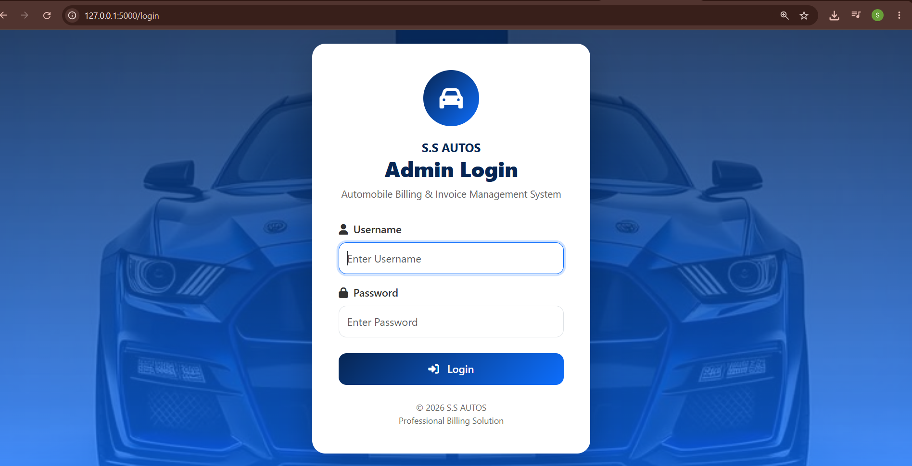
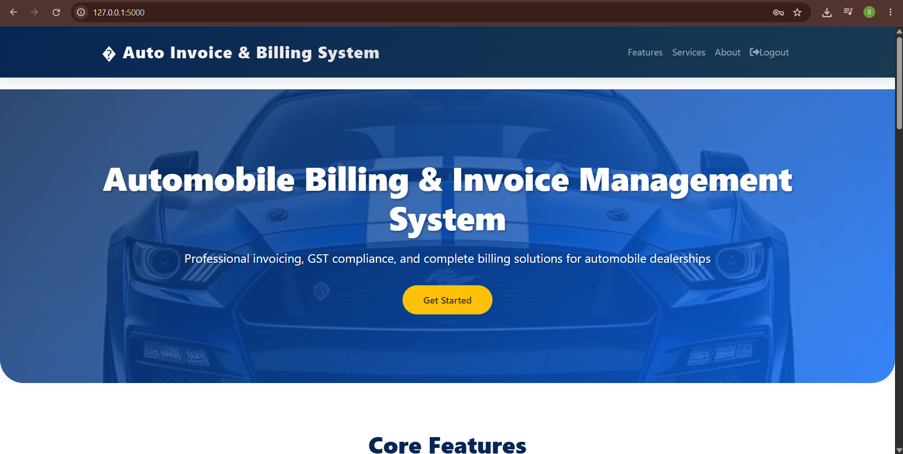
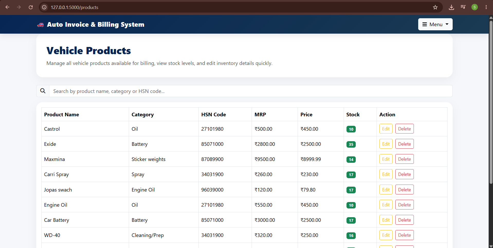
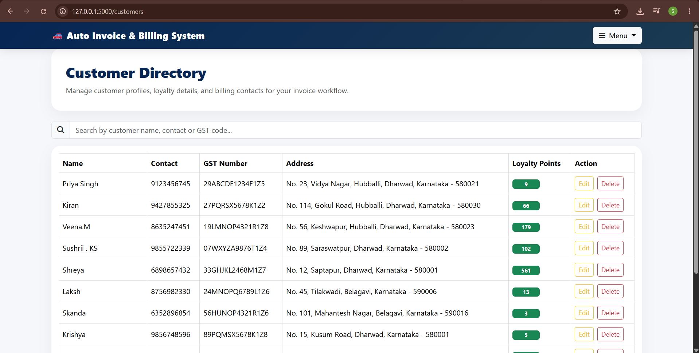
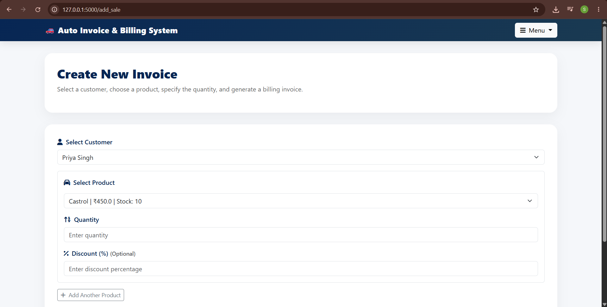
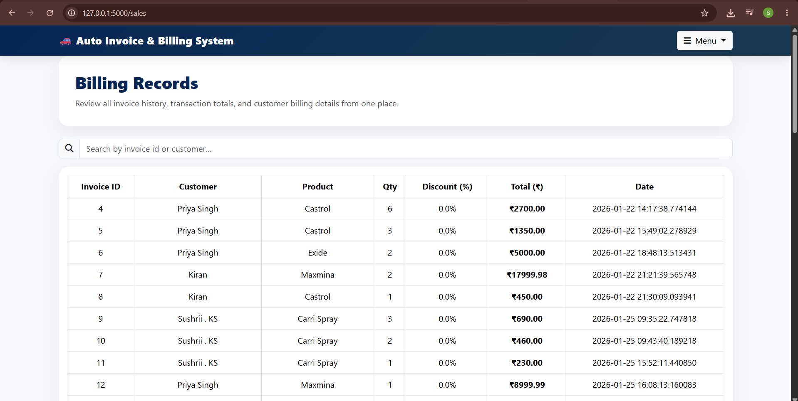
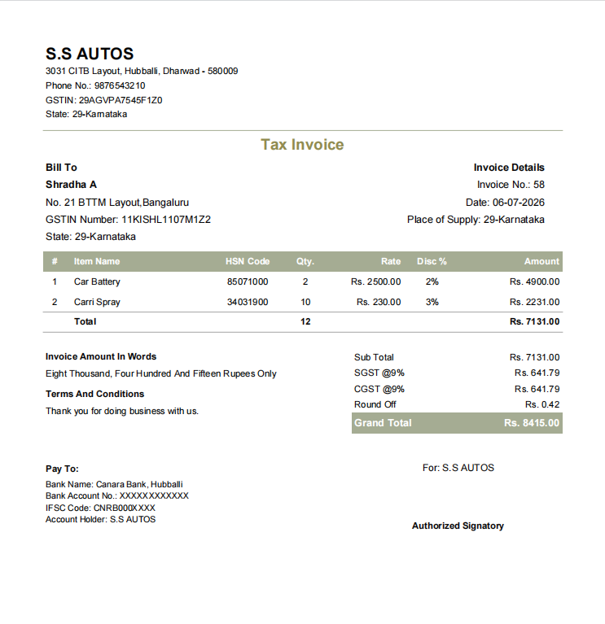

# 🚗 Automobile Sales & Billing Management System

A web-based Automobile Sales & Billing Management System developed using Python, Flask, SQLite, HTML, CSS, Bootstrap, and JavaScript.

## 📌 Features

- Vehicle Product Management
- Customer Management
- Invoice Generation (PDF)
- GST Billing (CGST & SGST)
- Discount Management
- Stock Management
- Search Products
- Search Billing Records
- Loyalty Points System
- Professional Invoice Design

## 🛠 Technologies Used

- Python
- Flask
- SQLite
- HTML
- CSS
- Bootstrap
- JavaScript
- FPDF

## 📸 Project Screenshots

### Login Page



### Home Page



### Vehicle Products



### Customers



### Create Invoice



### Billing Records



### Generated PDF Invoice



## 🚀 How to Run

```bash
pip install flask
pip install fpdf
pip install num2words

python app.py
```

Open your browser and visit:

```
http://127.0.0.1:5000
```

## 👩‍💻 Developed By

**Shradha Acharya**
